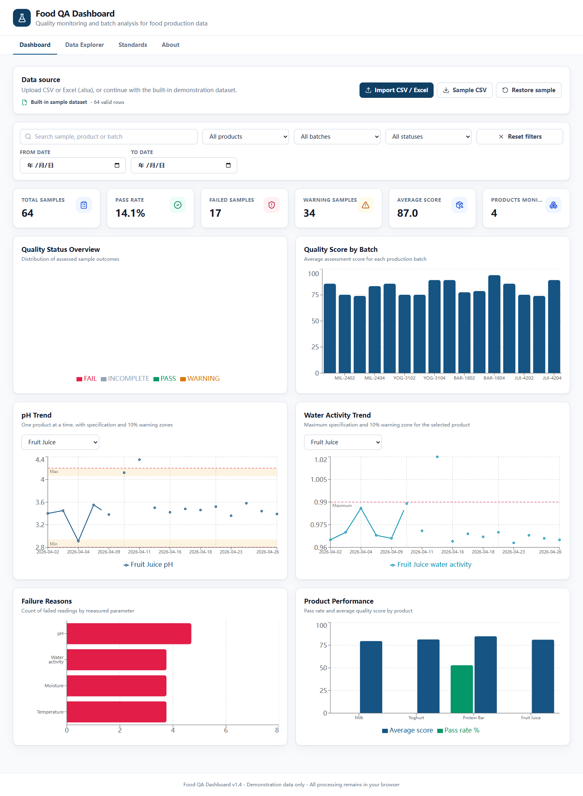
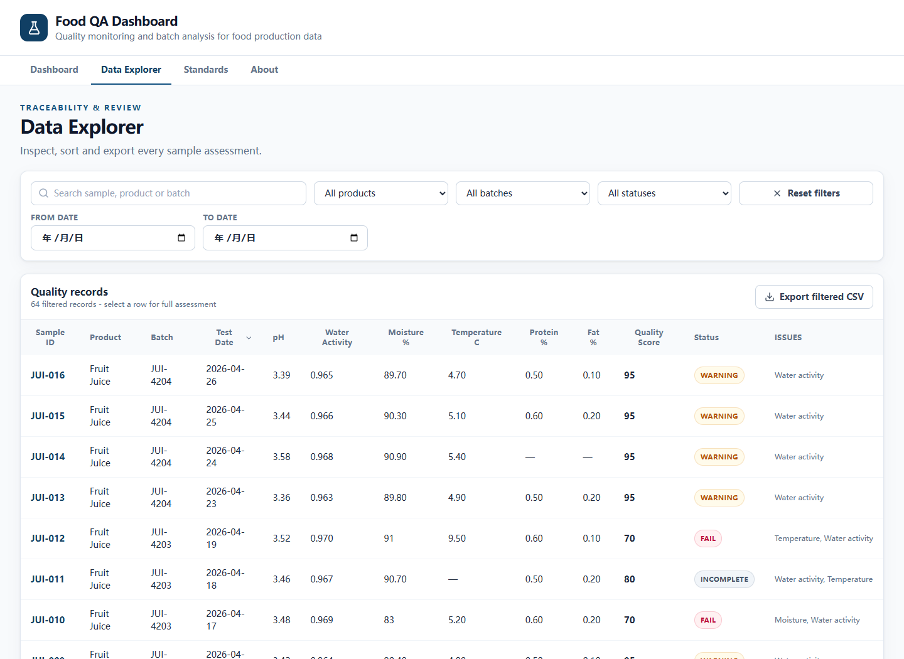
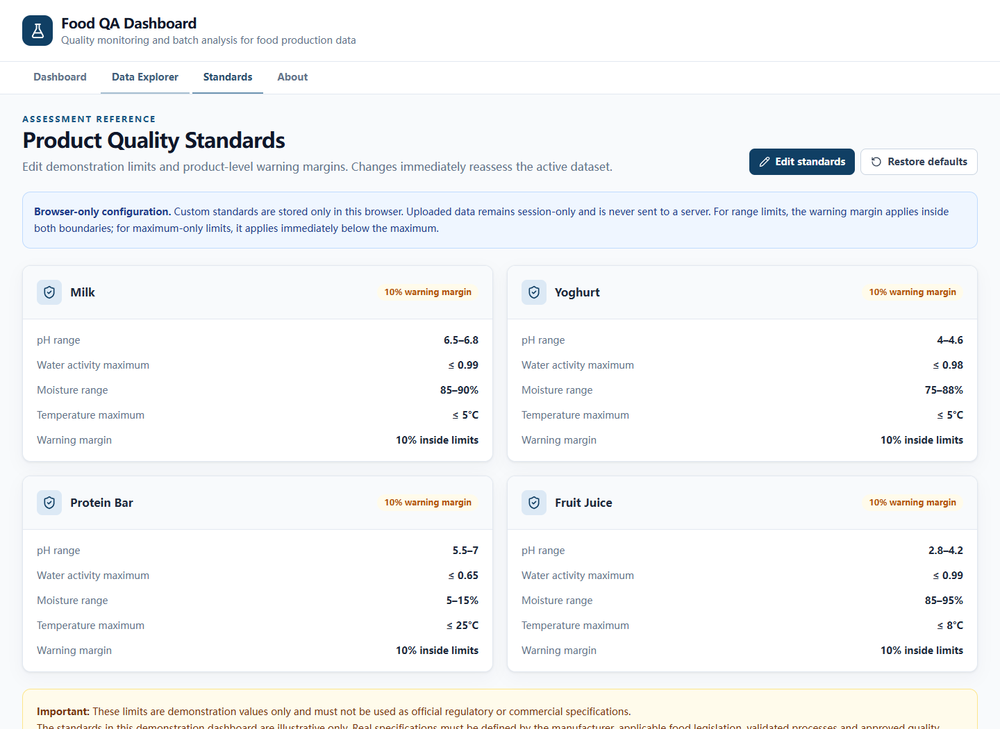

# Food QA Dashboard

[](https://github.com/wangwillianw315-alt/Food_QA_Dashboard/actions/workflows/ci.yml)

A portfolio-ready browser-based food quality analysis application for Food Science students, QA/QC personnel and Food Technologists. Import production test data, assess every sample against product-specific demonstration limits, investigate issues and review batch trends. All processing happens locally in the browser.

**Live demo:** https://food-qa-dashboard-tianyi.netlify.app



## Why this project

Food production teams often review large quality datasets in spreadsheets. This project demonstrates how repeatable assessment rules, clear exception reporting and batch-level visualisation can make that review faster and more traceable. It combines food quality domain knowledge with frontend engineering and data analysis.

See the full [portfolio case study](docs/portfolio-case-study.md).

## Features

- Local CSV and Excel `.xlsx` import with header validation, type conversion, blank-row removal and safe row-level errors
- Excel worksheet selection, automatic column matching, manual field mapping and five-row preview
- Real calendar-date validation, duplicate sample detection and case-insensitive known product matching
- 64-row built-in dataset covering Milk, Yoghurt, Protein Bar and Fruit Juice
- Independent parameter assessment with PASS, WARNING, FAIL and INCOMPLETE outcomes
- Live dashboard metrics and six responsive Recharts visualisations
- Product-specific pH and water activity trends with specification lines and warning zones
- Editable product limits and warning margins with immediate sample reassessment
- Browser-local standards persistence, validation, cancellation and one-click default restoration
- Explicit `SHELF_LIFE_TO_QA` JSON import with validation, preview and confirmation
- Linked lifecycle identifiers, draft or active product standards, batch-monitoring setup and metadata-only transfer history
- Product, batch, status, date-range and global text filters
- Sortable, paginated Data Explorer with detailed sample assessment drawer
- Export of the current filtered dataset to CSV
- Responsive professional QA interface; no backend, account or cloud dependency
- Session recovery for uploaded data, shareable page URLs and browser back/forward navigation

## Technology

React, TypeScript, Vite, Tailwind CSS, Recharts, PapaParse, ExcelJS, Lucide React, date-fns and Vitest.

## Three-minute demo

1. Open the Dashboard and review the status mix, average score and batch chart.
2. Filter to `Fruit Juice` and batch `JUI-4203` to expose failed and incomplete samples.
3. Open Data Explorer, select `JUI-012`, and compare temperature and water activity with their demonstration limits.
4. Export the filtered records to show a traceable QA review workflow.



## Install and run

```bash
npm install
npm run dev
```

Open the local URL printed by Vite (normally `http://localhost:5173`).

Production build:

```bash
npm run build
```

Tests:

```bash
npm run test
```

Run the complete verification suite in one command:

```bash
npm run check
```

## CSV and Excel format

The header must contain:

```csv
sample_id,product_name,batch_number,test_date,ph,water_activity,moisture_percent,temperature_c,protein_percent,fat_percent,status
```

`sample_id`, `product_name`, `batch_number` and `test_date` are identifying fields. The six measurement fields are numeric; `protein_percent` and `fat_percent` may be blank. A supplied `status` is ignored because the dashboard recalculates the result. Blank numeric values become `null`. Rows with invalid numbers or missing identifying fields are reported and excluded without interrupting valid rows.

Dates must be real calendar dates in `YYYY-MM-DD` format, and duplicate sample IDs within one upload are rejected after the first valid occurrence. Import issues can be reviewed directly in the dashboard.

Excel `.xlsx` workbooks can use different column labels such as `Sample ID`, `Lot Number`, `Inspection Date`, `aW` and `Temp C`. The import dialog automatically maps known aliases, allows the reviewer to select a worksheet and correct every mapping before confirming the import. Legacy `.xls` files are intentionally not supported.

Product names must match a configured demonstration or linked lifecycle standard; letter casing is normalised automatically. Unknown products are safely marked INCOMPLETE with a score of 0 because no configured comparison can be made.

Uploaded records are retained only in the current browser session so an accidental refresh does not lose the active analysis. They are not sent to a server. Restoring the sample dataset clears the saved session upload.

Custom demonstration standards are stored separately in browser local storage and remain available across sessions on the same browser. Saving or restoring standards immediately recalculates status, score and issue lists for the active records. Product identities cannot be edited, and invalid ranges are rejected before any assessment changes.

## FoodLab AI V1.0 hand-off

The Lifecycle Transfer workspace imports a user-selected `SHELF_LIFE_TO_QA` JSON file, validates and previews the linked product and confirmed shelf-life limits, and creates or links a QA standard and batch-monitoring setup only after confirmation. Imports do not silently replace existing standards. Unrecognized parameters remain visible for manual review, and transfer history stores metadata rather than the full payload.

## Quality assessment

Required parameters are pH, water activity, moisture and temperature.

- **PASS:** every required parameter is present and comfortably inside its limit.
- **WARNING:** a parameter remains inside its limit but is within 10% of a range boundary. For maximum-only limits, 90–100% of the maximum is a warning.
- **FAIL:** one or more parameters are outside their limits.
- **INCOMPLETE:** one or more required parameters are missing, or the product is unsupported.

The score starts at 100. Each failed parameter deducts 25, each warning deducts 5, and each missing required parameter deducts 15. The minimum score is 0. INCOMPLETE takes status precedence when required readings are absent, while all available readings are still assessed and scored.

## Data disclaimer

The limits and records in this repository are demonstration values only and must not be used as official regulatory or commercial specifications. Real specifications must be defined by the manufacturer, applicable food legislation, validated processes and approved quality documentation.



## Post-V1 roadmap

Potential future work includes PDF quality reports, control charts, statistical process control, stronger anomaly review and carefully constrained quality-summary assistance.

User accounts, cloud storage, multi-site collaboration and complex permissions remain out of scope until data ownership, privacy, validation and migration requirements are defined.

## Author

Developed by Tianyi Wang  
Bachelor of Food Science  
Lincoln University, New Zealand
