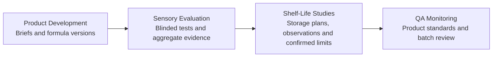

# FoodLab AI

**From Formula to Quality**

FoodLab AI is a modular educational food science platform covering:

- Product Development
- Sensory Evaluation
- Shelf-Life Studies
- Production Quality Monitoring

- **Live Demo:** [TO BE ADDED]
- **Demo Workflow:** [TO BE ADDED]
- **LinkedIn:** [TO BE ADDED]

## Overview

FoodLab AI is a local-first V1.0 portfolio platform that connects four independently runnable food-science applications through explicit, versioned JSON hand-offs. It demonstrates one product lifecycle from formulation and sensory evaluation through shelf-life study planning and production quality monitoring.

The repository includes a unified Portal, shared transfer contracts, lifecycle identifiers, metadata-only transfer history, scientific disclaimers, automated tests, and production builds. Existing module LocalStorage remains separate; there is no shared database or background synchronization.

This project uses demonstration data and is intended for education, technical evaluation, and employment portfolio presentation. It was created with AI-assisted development under human review of the software structure, food-science language, calculations, transfer boundaries, tests, and release documentation.

## Why I Built It

Food product development is usually represented across separate formulation sheets, sensory files, shelf-life plans, and quality records. I built FoodLab AI to show how those stages can exchange controlled information without erasing the scientific differences between them.

The V1.0 release focuses on traceability and explainability:

- each specialist application remains independently runnable;
- every cross-module hand-off is initiated and confirmed by the user;
- shared identifiers preserve lifecycle relationships;
- privacy-sensitive and unconfirmed data is excluded from transfers;
- limitations and scientific assumptions remain visible.

## Food Product Lifecycle



## Modules

| Module | Purpose | Default local URL |
|---|---|---|
| FoodLab AI Portal | Unified brand, module directory, lifecycle guide, About page, and portfolio entry point | `http://localhost:5173` |
| Food Product Development AI | Product briefs, formula versions, ingredient costs, estimated nutrition, trials, and development summaries | `http://localhost:5174` |
| Food Sensory AI | Blinded study design, response management, descriptive analysis, and aggregate result export | `http://localhost:5175` |
| Food Shelf Life Predictor | Storage-study planning, sampling schedules, observations, acceptance limits, and transparent model exploration | `http://localhost:5176` |
| Food QA Dashboard | Production-data import, linked standards, sample assessment, and batch-level quality monitoring | `http://localhost:5177` |

## Cross-Module Workflow

```text
Product Development
  -> PRODUCT_TO_SENSORY.json
Sensory Evaluation
  -> SENSORY_TO_SHELF_LIFE.json
Shelf-Life Validation
  -> SHELF_LIFE_TO_QA.json
QA Monitoring
```

All three transfers use the FoodLab envelope schema `1.0.0`. The source module downloads a JSON file, the target validates and previews it, and the user confirms creation of a linked record.

- Product Development excludes supplier identity and line-level cost data; aggregate sample cost is optional.
- Sensory exports aggregate results only and never panelist-level responses.
- Shelf Life exports only acceptance limits explicitly confirmed by the user.
- Imports do not silently replace existing records.
- Transfer history contains metadata rather than full payloads.

Canonical schemas, examples, identifier rules, and migration guidance are in [`shared-contracts/`](shared-contracts/).

## Demo Workflow

The guided demonstration is documented in [`demo-workflow/README.md`](demo-workflow/README.md). It uses three synthetic JSON files:

1. [`product-to-sensory.example.json`](demo-workflow/product-to-sensory.example.json)
2. [`sensory-to-shelf-life.example.json`](demo-workflow/sensory-to-shelf-life.example.json)
3. [`shelf-life-to-qa.example.json`](demo-workflow/shelf-life-to-qa.example.json)

Start all applications with `npm run dev:all`, open the Portal, and follow the lifecycle in order. The sample records are demonstration data and do not represent a real company, product approval, laboratory result, or customer engagement.

## Food Science Value

FoodLab AI demonstrates how software can support:

- traceable formulation versions and development decisions;
- blinded sensory-study planning and transparent descriptive analysis;
- condition-specific shelf-life study design and cautious model interpretation;
- product-specific quality limits and repeatable batch assessment;
- controlled data provenance across a food-product lifecycle.

The platform deliberately distinguishes planning evidence from validated scientific or regulatory evidence.

## Technical Architecture

- React, TypeScript, Vite, Tailwind CSS, Vitest, and module-specific scientific utilities.
- Five separate browser applications orchestrated from root npm scripts.
- Browser LocalStorage or SessionStorage for local persistence; no cloud database.
- Versioned JSON transfer contracts with shared lifecycle identifiers.
- Zod/schema validation, import previews, duplicate protection, and explicit confirmation.
- Root contract validation plus application-level unit and integration tests.

The applications remain separate because their framework versions, routing, state stores, UI systems, and internal data models differ. V1.0 shares transfer contracts rather than merging internal stores.

## Verified Tests and Builds

The V1.0 release gate passed:

- **242 application tests** across **34 test files**
- **3 example transfers** validated against **4 shared schemas**
- **5 production builds** completed successfully

Run the same verification locally:

```bash
npm run test:all
npm run build:all
```

Known non-blocking output is limited to jsdom chart-size notices in Product Development tests and bundle-size advisories for Sensory and Shelf Life.

## Local Installation

Requirements: Node.js 20 or newer and npm.

```bash
npm install
npm --prefix FoodLab_AI_Portal install
npm --prefix Food_Product_Development_AI install
npm --prefix Food_Sensory_AI install
npm --prefix Food_Shelf_Life_Predictor install
npm --prefix Food_QA_Dashboard install
```

Run all five applications:

```bash
npm run dev:all
```

Individual root commands are also available:

```bash
npm run dev:portal
npm run dev:product
npm run dev:sensory
npm run dev:shelf-life
npm run dev:qa
```

If local module URLs differ, copy `FoodLab_AI_Portal/.env.example` to a local `.env` and update only the URL values. Real environment files are ignored by Git.

## Repository Structure

```text
foodlab-ai/
|-- FoodLab_AI_Portal/
|-- Food_Product_Development_AI/
|-- Food_Sensory_AI/
|-- Food_Shelf_Life_Predictor/
|-- Food_QA_Dashboard/
|-- shared-contracts/
|-- demo-workflow/
|-- portfolio/
|-- employment/
|-- deployment/
|-- .github/
|-- README.md
|-- CHANGELOG.md
|-- RELEASE_NOTES_V1.0.md
|-- V1_RELEASE_CHECKLIST.md
|-- VERSION
|-- package.json
`-- .gitignore
```

The actual QA directory is `Food_QA_Dashboard`; no application was renamed to match an earlier draft name.

## Limitations

- Transfers are user-controlled JSON download/import operations, not automatic synchronization.
- Data is browser-profile and origin specific because each module retains separate local storage.
- V1.0 has no login, shared database, payment, multi-tenancy, or complex permissions.
- Transfer history is metadata-only and is not a cryptographically signed central audit trail.
- Demonstration ingredients, formulas, sensory responses, shelf-life observations, limits, and QA records are synthetic or illustrative.
- Outputs require appropriate experimental design, validated methods, laboratory evidence, applicable legislation, and qualified professional interpretation.

FoodLab AI is not a commercially validated system, a regulatory approval tool, or a substitute for laboratory testing or food-safety professionals. It cannot officially determine shelf life, approve a label, approve a product, or certify food safety.

## Roadmap

Post-V1 work may include:

- controlled Monorepo migration with protected application histories;
- shared runtime contract, identifier, transfer-history, and design-system packages;
- continuous integration with golden cross-module fixtures;
- dependency alignment and targeted route/code splitting;
- database, identity, permissions, and collaboration only after data ownership, privacy, validation, and migration requirements are defined.

No additional business module is part of the V1.0 release.

## Developer

**Tianyi Wang**  
Bachelor of Food Science  
Lincoln University, New Zealand

Supporting portfolio and employment notes are available in [`portfolio/`](portfolio/) and [`employment/`](employment/).
